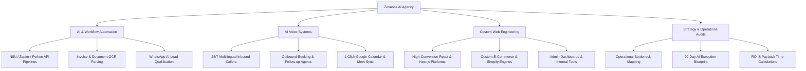

# 🚀 Zovance — Complete Master Documentation

---

## 🌟 Executive Overview

**Zovance** is an elite AI Automation & Custom Web Engineering agency. Operating under the banner **"Build Less. Automate More."**, Zovance designs, deploys, and maintains autonomous AI systems, 24/7 voice agents, and high-conversion web platforms for growing businesses across global markets.

Unlike traditional software development agencies that produce static code or static PDF reports, Zovance delivers **production-grade, autonomous operational pipelines** with **100% code ownership** and zero vendor lock-in.

---

## 🎯 Core Aim & Business Philosophy

### 1. The Core Problem Solved
Modern businesses waste thousands of human hours on manual data entry, lead qualification follow-ups, delayed customer support, and fragmented app integrations. This creates operational bottlenecks, missed revenue, and ballooning payroll costs.

### 2. The Zovance Vision
To enable businesses to **scale revenue exponentially without linearly increasing headcount**.

### 3. Guiding Principles
* **Result-Driven ROI**: Every system shipped is measured by hours saved, conversion rate increases, or operational cost reductions.
* **Zero Corporate Bloat**: Fast execution, plain-English engineering, and deployment-first mindsets over static slide decks.
* **100% Code & System Ownership**: Clients retain complete control of codebases, API credentials, and workflow blueprints.

---

## 💼 Agency Offerings & Core Services



### 1. AI & Workflow Automation
* **N8N / Zapier / Python Pipelines**: Seamlessly connect CRMs, databases, messaging apps, and external APIs.
* **Document & Receipt OCR Parsing**: Automated extraction of line items, totals, and tax data from PDF invoices directly into accounting platforms (QuickBooks, Tally) and Google Sheets.
* **WhatsApp Business Automation**: Instant 30-second inbound lead response, budget qualification, and automated brochure delivery.

### 2. AI Voice Systems
* **24/7 Multilingual Voice Agents**: Human-like conversational voice agents powered by Retell, Vapi, and OpenAI LLMs (supporting English, Hindi, and regional languages).
* **Automated Calendar & PMS Sync**: Real-time appointment scheduling with automated SMS/WhatsApp reminders.
* **Transcription & Sentiment Analysis**: Instant transcription, key point extraction, and CRM logging following every call.

### 3. Custom Web Engineering
* **Ultra-Fast Platforms**: React 19 & Next.js web applications engineered for sub-second load times (<800ms) and high conversion rates.
* **E-Commerce & Payments**: Custom checkout flows integrated with Stripe, Razorpay, UPI, and inventory ERPs.
* **Internal Business Portals**: Custom client portals, analytics tools, and team management dashboards.

### 4. Strategy & Operations Audits
* **Workflow Mapping**: Deep-dive analysis of existing team workflows to identify high-impact automation candidates.
* **90-Day Execution Roadmap**: Clear, prioritized implementation schedule with projected payback timelines (typically under 3 weeks).

---

## 🌐 Public Website Architecture & Features

The Zovance web platform is designed with a modern, high-impact aesthetic utilizing dark/light themes, glass-morphism visual elements, and interactive ROI widgets.

### Key Public Features
1. **Dynamic Dark / Light Theme Engine**:
   * Global state managed via Zustand store (`useStore`) with automatic preference persistence in `localStorage`.
   * Smooth CSS color transitions (`#080B13` dark vs `#FBFBF9` light) across all pages.
2. **Interactive Strategy Call Booking Modal (`BookingModal.jsx`)**:
   * Embedded slot picker for date and time selection.
   * Direct persistence to Firebase Firestore (`bookings` collection).
   * **1-Click Google Calendar + Google Meet Generator**: Instantly crafts `https://calendar.google.com/calendar/render` links with pre-filled event titles, agendas, attendee emails, and Google Meet setup guidance.
3. **100% Reliable Dual-Dispatch Email Submissions (`emailHelper.js`)**:
   * Simultaneous dispatch to **Direct Gmail Nodemailer API (`/api/sendEmail`)** and **FormSubmit.co Client AJAX fallback**.
   * Admin notifications delivered directly to `zovance6@gmail.com`.
   * Auto-confirmation email delivered to client with direct WhatsApp chat link (`+91 83098 27125`).
4. **Interactive Solution Finder & ROI Calculator**:
   * Directs visitors to recommended automation builds based on operational pain points.
5. **Interactive System Architecture Visualizer (`SystemArchitectureVisualizer.jsx`)**:
   * Canvas-rendered node graph visualizing workflow relationships.
6. **9,500+ Workflow Library Explorer (`/automations`)**:
   * Searchable database of production-tested n8n workflow blueprints.

---

## 🔐 Protected Admin System (`/admin`)

The platform includes a role-protected Admin Management Portal powered by Firebase Authentication and Firestore.

```
/admin
 ├── /dashboard           - Key Business Metrics & Overview
 ├── /crm                 - Lead Pipeline & Inquiry Management
 ├── /bookings            - Strategy Call Schedule & Status Tracker
 ├── /portfolio-projects  - Case Studies & Published Work CMS
 ├── /testimonials        - Client Quotes & Review Management
 ├── /projects            - Active Client Projects & Milestones
 ├── /team                - Team Members, Access Levels & Roles
 ├── /earnings            - Effort-Weighted Payout Calculations
 ├── /analytics           - Lead & Conversion Performance Charts
 ├── /disputes            - Project Dispute Resolution Center
 ├── /audit               - Complete System Activity Audit Log
 └── /blog                - Knowledge Hub Article CMS
```

### Core Admin Features
* **Firebase Google Authentication**: Secured sign-in (`AdminLogin.jsx`) restricted to authorized team email accounts.
* **Lead Pipeline (CRM)**: Status tracking (`new`, `contacted`, `converted`, `archived`) with 1-click status updates.
* **Effort-Based Financial Engine (`calculateProject`)**: Automated payout calculations based on team member effort levels (`core`, `led`, `contributed`), company reserve percentages, and business development bonuses.
* **Content Management System (CMS)**: Create, edit, publish, or draft blog posts, portfolio projects, and customer testimonials.

---

## 👥 Foundational Engineering Team

* **Kodeboyina Venkat Karthik** — Founder & Lead (Strategy, AI Architecture & Business Development)
* **Akshath Tumkur** — Full-Stack Developer (React, Node.js, System Architecture)
* **Sahil Ranakoti** — AI & ML Engineer (Python, Voice AI & LLM Systems)
* **Jayanth Karthik Enaganti** — Product & Strategy (Product Design & Client Success)
* **Vikas Reddy Kalamalla** — Infrastructure Engineer (Cloud, DevOps & Deployment)
* **Nishanth Konakondu** — Backend Engineer (APIs, Databases & Integrations)
* **Varshith** — Frontend Engineer (React UI/UX & Performance)
* **Gudipati Srinadh** — QA & Testing (Automation & Quality Assurance)

---

## 🛠️ Technology Stack Summary

| Layer | Technologies |
| :--- | :--- |
| **Frontend Framework** | React 19, Vite 8, React Router DOM 7 |
| **State Management** | Zustand (Global Theme & Application State) |
| **Styling Engine** | Vanilla CSS, Glass-Morphism Utilities, Tailwind CSS 4 |
| **Database & Auth** | Firebase Firestore, Firebase Authentication |
| **Email & Dispatch** | Nodemailer (Gmail Transporter API) + FormSubmit.co |
| **AI & Automation** | N8N, OpenAI GPT-4, Vapi/Retell Voice, Document AI |
| **Icons & Visuals** | Lucide React, OGL (Canvas 3D Visualizer) |

---

*Documentation maintained by Zovance Engineering Team.*
